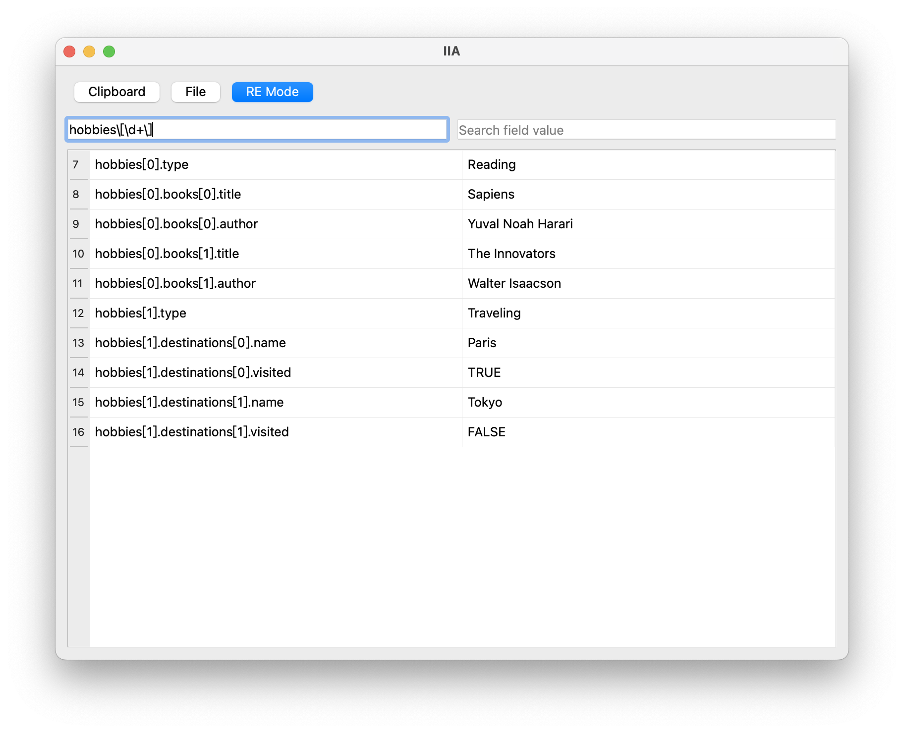

# iia

**iia** is a desktop application similar to [gron](https://github.com/tomnomnom/gron), designed to flatten JSON data and display it in a more accessible, non-nested format. Built using **Qt5** for the UI, it provides a user-friendly interface with powerful search capabilities.

## Features

- **JSON Flattening**: Converts nested JSON structures into a flat format for easier viewing and analysis.
- **Qt5 UI**: Intuitive desktop interface for seamless user experience.
- **Search & Regex Matching**: Supports both plain text search and regular expression queries for efficient JSON exploration.

## Screenshot
